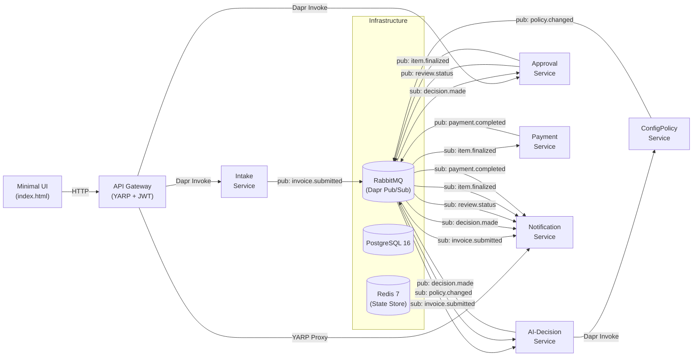

# ApprovalFlow

**Invoice & Expense Approval Platform** - A microservice-based, AI-assisted system that automates invoice and expense approvals for large enterprises.


[](https://github.com/RivkaFiga/Approval-Flow/actions/workflows/ci.yml)

---

## Table of Contents

- [Project Overview](#project-overview)
- [Features](#features)
- [Architecture](#architecture)
- [Tech Stack](#tech-stack)
- [Project Structure](#project-structure)
- [Prerequisites](#prerequisites)
- [Installation](#installation)
- [Configuration](#configuration)
- [Running the Application](#running-the-application)
- [Running Tests](#running-tests)
- [API Documentation](#api-documentation)
- [Docker](#docker)
- [Database](#database)
- [Development Workflow](#development-workflow)
- [Future Improvements](#future-improvements)

---

## Project Overview

ApprovalFlow ingests invoices and expenses, evaluates each one against a configurable company expense policy using an AI agent, **auto-approves the low-risk majority** and **escalates unclear, risky, or high-value cases to a human reviewer**. Approved items flow through a payment pipeline with budget reservation and compensation, and every decision is fully auditable via a single correlation ID.

**The central design principle:** a deterministic router enforces the autonomy ceiling - the AI agent can *advise*, but the final routing decision (auto-approve, human-review, reject) is always deterministic and configurable, never delegated to the LLM.

| Control | Default | Meaning |
|---|---|---|
| Autonomy Ceiling | **$250 USD** | Auto-approve only when the USD amount is at or below this threshold |
| Confidence Threshold | **0.80** | Auto-approve only when AI confidence meets or exceeds this value |
| Hard Stops | Always human | New vendor, FX hard stop, math mismatch, fraud signal, missing receipt |

---

## Features

- **Asynchronous Intake** - Immediate `202 Accepted` with tracking ID; results delivered asynchronously via status polling
- **AI-Powered Policy Evaluation** - Google Gemini integration (with stub mode for local development) evaluates invoices against the company expense policy
- **Deterministic Routing** - Configurable autonomy ceiling and confidence thresholds enforce routing rules independently of the AI model
- **Durable Human-in-the-Loop** - Dapr Workflow-based approval queue that survives service restarts between pause and resume
- **Payment Saga** - Budget reservation, payment execution, and compensation on failure with exactly-once guarantees
- **Live Status Tracking** - Real-time status projection from submission through payment via a single tracking ID
- **Hot-Reloadable Policy** - Update expense policy rules, thresholds, and FX rates at runtime without redeployment
- **Idempotent Processing** - Deduplication at intake and idempotent event handling across all services
- **Full Audit Trail** - Correlation ID propagation across all services with structured logging (Serilog) and distributed tracing (OpenTelemetry)
- **Minimal Web UI** - Single-page HTML form for invoice submission and real-time status tracking
- **API Gateway** - YARP-based reverse proxy with JWT authentication, role-based authorization, and rate limiting

---

## Architecture

ApprovalFlow follows a **microservice architecture** with six domain services behind a single API gateway, all communicating exclusively through Dapr sidecars via service invocation (synchronous) and pub/sub over RabbitMQ (asynchronous).

Each service is **independently deployable** and internally layered using **Clean Architecture** (Domain -> Application -> Infrastructure -> API), with the dependency rule pointing inward. The only shared code is `ApprovalFlow.Contracts` (events and DTOs).



### End-to-End Flow

1. **Intake** - Gateway receives an invoice, forwards it to Intake via Dapr. Intake validates, deduplicates, persists, and publishes `invoice.submitted`.
2. **AI Decision** - AI-Decision subscribes, fetches the active policy snapshot from ConfigPolicy, evaluates the invoice (Gemini or stub), and publishes `decision.made` with a route (`AutoApprove` / `HumanReview` / `Reject` / `Duplicate`).
3. **Approval** - Approval subscribes, and based on the route: auto-approves immediately, or creates a durable workflow that pauses until a human acts. Publishes `item.finalized`.
4. **Payment** - Payment subscribes, reserves budget, executes payment (simulated provider), and publishes `payment.completed`. On failure, compensates the reservation.
5. **Notification** - Notification subscribes to all events and maintains a status projection queryable via `GET /api/status/{trackingId}`.

### Service Responsibilities

| Service | Responsibility |
|---|---|
| **Gateway** | Single entry point. YARP reverse proxy, JWT authentication (HS256), role-based authorization (Submitter/Approver/Admin), rate limiting, Swagger UI |
| **Intake** | Accepts invoices, validates, deduplicates, persists with outbox pattern, publishes events |
| **AI-Decision** | Evaluates invoices against expense policy using Gemini (or stub), applies deterministic routing rules |
| **Approval** | Manages approval workflows via Dapr Workflow, durable human-in-the-loop queue, approver actions |
| **Payment** | Budget reservation and release, simulated payment execution, saga compensation on failure |
| **Notification** | Event-sourced status projection, serves live submission status to UI/API |
| **ConfigPolicy** | CRUD for expense policies, thresholds, FX rates; publishes `policy.changed` for hot-reload |

---

## Tech Stack

| Concern | Technology | Purpose |
|---|---|---|
| Runtime | .NET 8 / C# | Application framework for all services |
| API Gateway | YARP 2.2 | Reverse proxy with dynamic routing |
| Authentication | JWT Bearer (HS256) | Stateless authentication with role-based authorization |
| Service Mesh | Dapr 1.14 | Service invocation, pub/sub, state, secrets, workflow |
| Durable Workflows | Dapr Workflow | Payment saga and human-in-the-loop approval |
| Message Broker | RabbitMQ 3.13 | Asynchronous event-driven communication (via Dapr) |
| State Store | Redis 7 | Actor state and distributed state (via Dapr) |
| Database | PostgreSQL 16 | Per-service persistent storage |
| ORM | EF Core 8.0 + Npgsql | Database access with code-first migrations |
| AI / LLM | Google Gemini 1.5 Flash | Policy evaluation (stub mode available) |
| Logging | Serilog | Structured JSON logging with correlation IDs |
| Tracing | OpenTelemetry | Distributed tracing with OTLP export |
| Health Checks | ASP.NET Core Health Checks | `/healthz` and `/readyz` endpoints on every service |
| API Docs | Swashbuckle 6.8 | Swagger/OpenAPI on every service |
| Testing | xUnit + NSubstitute | Unit, integration, and E2E tests |
| CI/CD | GitHub Actions | Build, test, Docker compose E2E |
| Containerization | Docker + Docker Compose | Single-command full-stack deployment |

---

## Project Structure

```
ApprovalFlow/
  .github/workflows/ci.yml         # CI pipeline (build, unit tests, E2E)
  dapr/
    components/                     # Dapr component definitions (pub/sub, state, secrets)
    configs/                        # Per-service Dapr configuration (access control, tracing)
    secrets/                        # Local secrets (gitignored; auto-generated from example)
  src/
    gateway/
      ApprovalFlow.Gateway/         # YARP gateway, JWT auth, controllers, wwwroot UI
      ApprovalFlow.Gateway.Tests/
    services/
      intake/                       # Invoice intake and deduplication
      ai-decision/                  # AI policy evaluation and routing
      approval/                     # Durable approval workflows
      payment/                      # Budget and payment management
      notification/                 # Status projection
      config-policy/                # Policy configuration and hot-reload
    shared/
      ApprovalFlow.Contracts/       # Shared events, DTOs, and enums (the ONLY shared code)
      ApprovalFlow.ServiceDefaults/ # Cross-cutting: Serilog, OpenTelemetry, Swagger, health checks
  tests/
    ApprovalFlow.E2E/               # End-to-end integration tests
  ApprovalFlow.sln                  # Solution file (36 projects)
  Directory.Build.props             # Shared build properties
  Dockerfile                        # Multi-stage build (shared by all services)
  docker-compose.yml                # Full-stack orchestration
  ARCHITECTURE.md                   # Detailed architecture design document
  policy.md                         # Northwind expense policy (rules enforced by the system)
  sample-invoices.json              # Labeled test fixtures with expected routes
```

Each service follows the **Clean Architecture** layering convention:

| Layer | Project Suffix | Depends On | Contains |
|---|---|---|---|
| Domain | `.Domain` | Nothing | Entities, value objects, domain logic |
| Application | `.Application` | Domain, Contracts | Use cases, ports/interfaces |
| Infrastructure | `.Infrastructure` | Application, Domain, Contracts | EF Core, Dapr clients, external integrations |
| API (Host) | `.Api` | Application, Infrastructure, Contracts | Controllers, DI composition, Program.cs |
| Tests | `.Tests` | All layers | Unit and integration tests |

---

## Prerequisites

- [.NET 8 SDK](https://dotnet.microsoft.com/download/dotnet/8.0)
- [Docker Desktop](https://www.docker.com/products/docker-desktop/) (with Docker Compose v2)
- (Optional) [Dapr CLI](https://docs.dapr.io/getting-started/install-dapr-cli/) for local debugging outside Docker

---

## Installation

```bash
# Clone the repository
git clone https://github.com/RivkaFiga/Approval-Flow.git
cd Approval-Flow

# Restore dependencies and build
dotnet restore ApprovalFlow.sln
dotnet build ApprovalFlow.sln
```

---

## Configuration

### Secrets

The `dapr/secrets/secrets.example.json` template is automatically copied to `secrets.json` on first `docker compose up` by the `secrets-bootstrap` init container. The actual `secrets.json` is gitignored.

To customize secrets before first run:

```bash
cp dapr/secrets/secrets.example.json dapr/secrets/secrets.json
# Edit dapr/secrets/secrets.json with your values
```

### Key Configuration

| Variable / Setting | Location | Default | Description |
|---|---|---|---|
| `Jwt:SigningKey` | Gateway `appsettings.json` | Dev key (32+ bytes) | HS256 JWT signing key |
| `Jwt:Issuer` | Gateway `appsettings.json` | `approvalflow-dev` | JWT issuer claim |
| `Jwt:Audience` | Gateway `appsettings.json` | `approvalflow-gateway` | JWT audience claim |
| `RateLimit:PermitLimit` | Gateway `appsettings.json` | `100` | Requests per window |
| `RateLimit:WindowSeconds` | Gateway `appsettings.json` | `60` | Rate limit window duration |
| `Gemini:UseStub` | AI-Decision `appsettings.json` | `true` | Use stub AI agent (no API key needed) |
| `Gemini:ApiKey` | AI-Decision `appsettings.json` | `""` | Google Gemini API key (required when `UseStub=false`) |
| `Gemini:Model` | AI-Decision `appsettings.json` | `gemini-1.5-flash` | Gemini model name |
| `PolicySnapshot:CeilingUsd` | AI-Decision `appsettings.json` | `250` | Autonomy ceiling in USD |
| `PolicySnapshot:MinConfidence` | AI-Decision `appsettings.json` | `0.80` | Minimum confidence for auto-approval |
| Connection strings | `docker-compose.yml` env | Per-service PostgreSQL DB | `Host=postgres;Database=<db>;...` |

### Dapr Components

| Component | Type | Backend |
|---|---|---|
| `approvalflow-pubsub` | Pub/Sub | RabbitMQ (`rabbitmq:5672`) |
| `approvalflow-statestore` | State Store | Redis (`redis:6379`) |
| `approvalflow-secretstore` | Secret Store | Local file (`secrets.json`) |

---

## Running the Application

### Full Stack (Recommended)

A single command brings up the entire platform - all six services with Dapr sidecars, PostgreSQL, RabbitMQ, Redis, and supporting infrastructure:

```bash
docker compose up -d
```

The system is ready when all health checks pass. The Gateway is exposed at **http://localhost:5100**.

### Accessing the UI

Open **http://localhost:5100** in a browser. The minimal web UI provides:
- An invoice submission form with all required fields
- Real-time status tracking that polls until a final decision is reached

In development mode, the UI automatically fetches a JWT token from the `/dev/token` endpoint.

### Stopping

```bash
docker compose down       # Stop and remove containers
docker compose down -v    # Also remove volumes (resets databases)
```

### Exposed Ports

| Service | Port | Purpose |
|---|---|---|
| Gateway | `5100` | API entry point and UI |
| Approval | `5102` | Direct access (Swagger) |
| Notification | `5106` | Direct access (Swagger) |
| ConfigPolicy | `5108` | Direct access (Swagger) |
| PostgreSQL | `5432` | Database |
| RabbitMQ Management | `15672` | Broker dashboard (user: `approvalflow` / pass: `approvalflow`) |

---

## Running Tests

### Unit Tests

Run all unit tests across all services:

```bash
dotnet test ApprovalFlow.sln --filter "FullyQualifiedName!~E2E"
```

Or run tests for a specific service:

```bash
dotnet test src/services/intake/ApprovalFlow.Intake.Tests/
dotnet test src/services/ai-decision/ApprovalFlow.AiDecision.Tests/
dotnet test src/services/approval/ApprovalFlow.Approval.Tests/
dotnet test src/services/payment/ApprovalFlow.Payment.Tests/
dotnet test src/services/notification/ApprovalFlow.Notification.Tests/
dotnet test src/services/config-policy/ApprovalFlow.ConfigPolicy.Tests/
dotnet test src/gateway/ApprovalFlow.Gateway.Tests/
```

### End-to-End Tests

E2E tests require the full Docker Compose stack to be running:

```bash
# Start the stack
docker compose up -d

# Wait for all services to be healthy, then run E2E tests
dotnet test tests/ApprovalFlow.E2E/
```

E2E test coverage includes:
- **Gateway Security** - JWT authentication and authorization enforcement
- **Invoice Flow** - Full end-to-end submission through payment
- **Human Review Approval** - Durable HITL workflow with approver actions
- **Policy Hot-Reload** - Runtime policy updates reflected in subsequent decisions
- **UI Flow** - Browser-based submission and status tracking

---

## API Documentation

Every service exposes a Swagger UI. When running with Docker Compose:

| Service | Swagger URL |
|---|---|
| Gateway | http://localhost:5100/swagger |
| Approval | http://localhost:5102/swagger |
| Notification | http://localhost:5106/swagger |
| ConfigPolicy | http://localhost:5108/swagger |

### Key Endpoints

**Gateway (http://localhost:5100)**

| Method | Endpoint | Auth | Description |
|---|---|---|---|
| `POST` | `/api/intake` | Submitter | Submit an invoice for processing |
| `GET` | `/api/status/{trackingId}` | Authenticated | Poll submission status (proxied to Notification via YARP) |
| `GET` | `/approvals/queue` | Approver | List items awaiting human review |
| `POST` | `/approvals/{trackingId}/approve` | Approver | Approve a pending item |
| `POST` | `/approvals/{trackingId}/reject` | Approver | Reject a pending item |
| `POST` | `/approvals/{trackingId}/request-info` | Approver | Request additional information |
| `POST` | `/dev/token` | None | Generate a dev JWT token (development only) |

**ConfigPolicy (http://localhost:5108)**

| Method | Endpoint | Description |
|---|---|---|
| `GET` | `/api/policy-snapshot` | Current active policy snapshot (used by AI-Decision) |
| `GET` | `/api/policies` | List all policies |
| `GET` | `/api/policies/{id}` | Get a policy by ID |
| `POST` | `/api/policies` | Create a new policy (publishes `policy.changed`) |
| `PUT` | `/api/policies/{id}` | Update a policy (optimistic concurrency via `ExpectedVersion`) |
| `DELETE` | `/api/policies/{id}` | Deactivate and soft-delete a policy |

---

## Docker

### Services Overview

The `docker-compose.yml` defines:

- **7 application containers** (Gateway + 6 domain services)
- **7 Dapr sidecar containers** (one per service, using `network_mode: service:<name>`)
- **3 infrastructure containers** (PostgreSQL, RabbitMQ, Redis)
- **2 Dapr control-plane containers** (Placement, Scheduler - required for Dapr Workflow)
- **1 init container** (secrets-bootstrap - copies secrets template on first run)

### Building Images

All services share a single multi-stage Dockerfile parameterized via build args:

```bash
docker compose build
```

### Useful Commands

```bash
# View logs for a specific service
docker compose logs -f gateway

# View logs for a service and its sidecar
docker compose logs -f intake intake-dapr

# Restart a single service (restart its sidecar too)
docker compose restart intake intake-dapr

# Rebuild and restart a single service
docker compose up -d --build intake
```

---

## Database

- **Technology:** PostgreSQL 16 (Alpine)
- **ORM:** Entity Framework Core 8.0 with Npgsql
- **Strategy:** Code-first with EF Core migrations
- **Migrations:** Applied automatically on service startup (`MigrateAsync()`)
- **Shared instance, per-service contexts:** All services connect to a single PostgreSQL database (`approvalflow`), each through its own EF Core DbContext and connection string key (`IntakeDb`, `AiDecisionDb`, `ApprovalDb`, `PaymentDb`, `NotificationDb`, `ConfigPolicyDb`). Each service manages its own tables — there are no cross-service joins or shared schemas.

Default credentials (development): `postgres` / `postgres` on `localhost:5432`.

### Seed Data

- **ConfigPolicy** seeds a default active policy with autonomy thresholds, FX rates, and known vendors on first startup
- **Payment** seeds initial department budgets (Marketing, Engineering, Sales) on first startup

---

## Development Workflow

1. **Run the full stack** with `docker compose up -d`
2. **Make code changes** in the relevant service
3. **Rebuild only the changed service:**
   ```bash
   docker compose up -d --build <service-name>
   # Remember to also restart its Dapr sidecar:
   docker compose restart <service-name>-dapr
   ```
4. **Run unit tests** for the changed service:
   ```bash
   dotnet test src/services/<service>/ApprovalFlow.<Service>.Tests/
   ```
5. **Run E2E tests** to verify end-to-end behavior:
   ```bash
   dotnet test tests/ApprovalFlow.E2E/
   ```
6. **Check the UI** at http://localhost:5100 to verify the change works
7. **Monitor the RabbitMQ dashboard** at http://localhost:15672 for message flow visibility

### CI Pipeline

The GitHub Actions CI pipeline (`.github/workflows/ci.yml`) runs on every push to `main` and on all pull requests:

1. Restores and builds the solution
2. Runs unit tests for each domain service (Intake, AiDecision, Approval, Payment, Notification, ConfigPolicy)
3. Builds all Docker images
4. Starts the full stack and waits for health checks
5. Runs E2E tests against the running stack
6. Uploads test results as artifacts on failure

---

## Future Improvements

- **Production Identity Provider** - Replace self-signed JWT with a real IdP (e.g., Keycloak, Auth0)
- **Real Payment Integration** - Replace the simulated payment provider with actual payment rail integration
- **OCR Ingestion** - Add document scanning and structured data extraction for paper invoices
- **RAG-Based Policy Retrieval** - Retrieve only relevant policy rules per invoice instead of sending the full policy to the LLM
- **mTLS Between Services** - Enable Dapr mTLS for production-grade service-to-service encryption
- **Horizontal Scaling** - Kubernetes deployment manifests for multi-replica scaling
- **Observability Dashboard** - Grafana dashboards for metrics and distributed trace visualization

---

## Further Reading

- [ARCHITECTURE.md](ARCHITECTURE.md) - Detailed architecture design document with ADRs and requirement traceability
- [policy.md](policy.md) - The expense policy rules enforced by the system
- [sample-invoices.json](sample-invoices.json) - Labeled test fixtures covering every decision path
